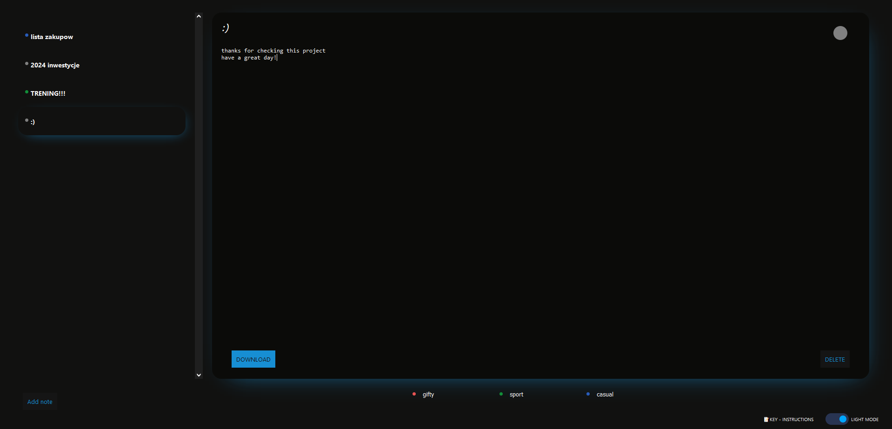

# [yourPersonalNMtebook](https://xmavv-notebook.netlify.app/)

## Table of contents

- [Overview](#overview)
    - [The challenge](#the-challenge)
- [My process](#my-process)
    - [Build with](#built-with)
    - [Features](#features)
    - [What I learned](#what-i-learned)
- [Author](#author)

## Welcome 😎

## Overview

### The challenge

The challenge was to implement first react SPA on my own.

However project went even further, I added a lot more stuff and features.

## My process

### Built with

- react
- css

### Features

- downloading selected note
- notification every successed action
- notes updates themselves after not editing them for 5secs, at the same time saving in the local storage
- light/dark mode
- using app with keyboard

### What I learned

- how to implement theme switcher with checkbox
- downloading file throught blob
- using other npm components like toast (thanks to emil kowalski https://github.com/emilkowalski/sonner)
- debouncing while downloading a note (cannot download note within 5seconds after u did it already)